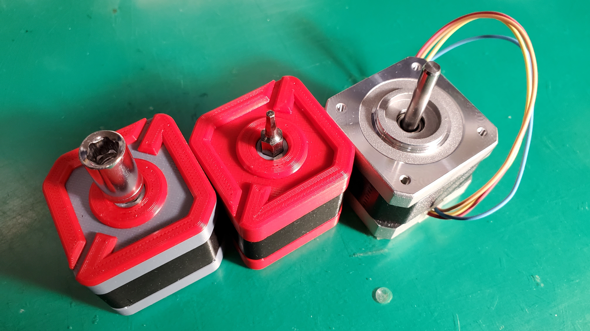
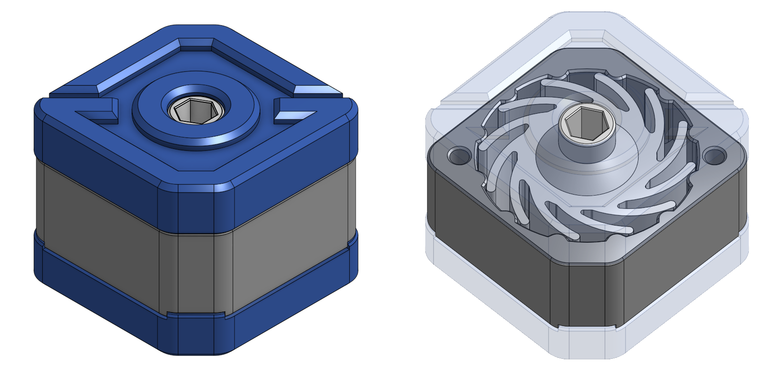
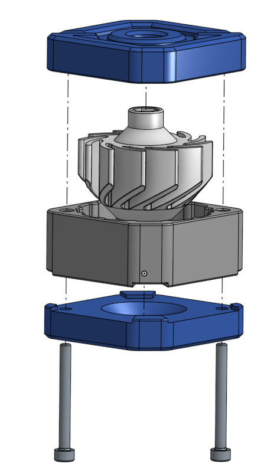

# Steppy Torque Wrench

A 3D printed torque wrench design inspired by the [LDO mascot - Steppy](https://github.com/LDOMotors/steppy).

The dimension is designed to match a NEMA14 stepper motor.

It is designed in Onshape. The source document is available [here](https://cad.onshape.com/documents/7757bbd2fae1f89970d7d2aa/v/2d5d2a3ecf0a82dfcd18c462/e/0d795f65862312b47a7678c6).

## BOM

### Printed Parts

The torque of the wrench depends on the print settings and material, so you may need to test rotors with different number of fins.

All the parts in the STLs folder is oriented for printing without support.

0.4mm line width, 0.2 mm layer height, 3 perimeters, 30% infill.

### Extra Hardware

- 2 x M3x25 or M3x30 SHCS/BHCS
- Bits with 1/4" (6.35mm) hexagon drive

## Assembly

The M3 screws are threaded directly into printed part. Don't over-tighten them.

## So, How Much Torque Does It Provide?

First of all, **this is not a tool designed for heavy duty or high precision usage**. From the discription of [Fixed Torque Wrench Handles by A_R_B](https://www.thingiverse.com/thing:2613057), the bit would possibly strip the printed holder for torque over 3Nm.

The torque varies a lot by materials and print settings. Usually PLA is much stiffer than ABS and PETG.
The recommended method is to try printing out rotors with different number of fins and pick the one that meets your usage. **The rotors share the same case**.

## Acknowledgement

- Fixed Torque Wrench Handles by A_R_B on [Thingiverse](https://www.thingiverse.com/thing:2613057) and [Printables](https://www.printables.com/model/24539-torque-wrench-handles-from-10nm-up-to-30nm) for the inspiration of the rotor design.
- [LDO mascot - Steppy](https://github.com/LDOMotors/steppy) for the logo on stepper motor.

## Demo Video

## Photos

## Disclosure

This is not an "official" LDO motors project.
I am just a designer that like their product and had an eureka moment.

## Changelog

### 2022-03-07

- Initial release

---

If you like this design you can support my work:

